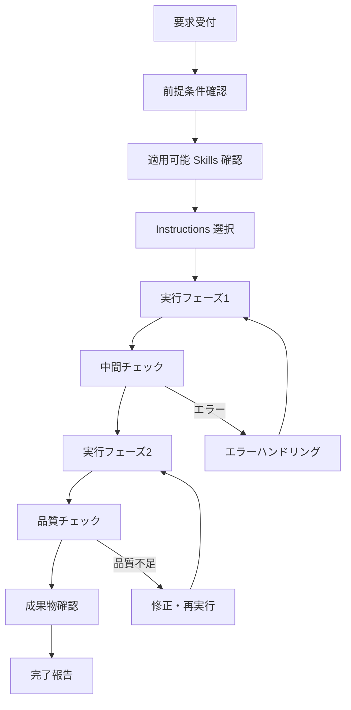
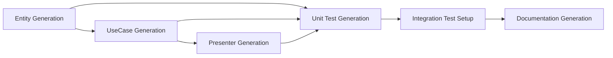

# .ai-assistant/instructions

このディレクトリには、AI Assistant が実行する具体的な手順書（Instructions）が定義されています。

## Instructions とは

**Instructions** は「**どうやるか**」を定義する具体的な実行手順書です。

- ステップ・バイ・ステップの作業手順
- 判断基準とエラーハンドリング
- 品質チェック項目
- 成果物の検証方法

## Instructions の構造

### 基本形式

```markdown
# {Task Name} Instructions

## 概要
この手順書の目的と概要

## 前提条件
- 必要な Skills
- 必要な環境・ツール
- 前提となる状態

## 実行手順

### フェーズ1: {フェーズ名}
#### ステップ1.1: {具体的作業}
1. 具体的な操作1
2. 具体的な操作2
3. 判断基準・確認事項

#### ステップ1.2: {具体的作業}
...

### フェーズ2: {フェーズ名}
...

## 品質チェック
- [ ] チェック項目1
- [ ] チェック項目2

## エラーハンドリング
- エラー条件A → 対処法A
- エラー条件B → 対処法B

## 成果物
- 生成されるファイル・フォルダ
- 期待される結果

## 注意事項
- 重要な注意点
- 制約事項
```

### Instructions のタイプ

| タイプ | 説明 | 例 |
|--------|------|-----|
| **Generation** | 何かを新規作成する | テストクラス生成、エンティティ生成 |
| **Modification** | 既存のものを変更する | リファクタリング、最適化 |
| **Analysis** | 分析・調査を行う | コード品質分析、依存関係分析 |
| **Validation** | 検証・確認を行う | テスト実行、品質チェック |
| **Documentation** | ドキュメントを作成する | API文書生成、README作成 |

## カテゴリ別 Instructions 一覧

### 🧪 Testing Instructions

テスト関連の実行手順書

| Instructions | 対象 | ファイル |
|--------------|------|----------|
| Unit Test Generation | Entity, UseCase, ValueObject | [`unit-test-generation-instructions.md`](testing/unit-test-generation-instructions.md) |
| Integration Test Setup | システム全体 | [`integration-test-instructions.md`](testing/integration-test-instructions.md) |
| Test Data Setup | テストデータ | [`test-data-setup-instructions.md`](testing/test-data-setup-instructions.md) |
| Mock Generation | インターフェース | [`mock-generation-instructions.md`](testing/mock-generation-instructions.md) |

**適用 Skills**: Unit Testing, Integration Testing, Unity Testing

### 🏗️ Code Generation Instructions

コード生成関連の実行手順書

| Instructions | 対象 | ファイル |
|--------------|------|----------|
| Entity Generation | データモデル | [`entity-generation-instructions.md`](code-generation/entity-generation-instructions.md) |
| UseCase Generation | ビジネスロジック | [`usecase-generation-instructions.md`](code-generation/usecase-generation-instructions.md) |
| Presenter Generation | プレゼンテーション | [`presenter-generation-instructions.md`](code-generation/presenter-generation-instructions.md) |
| DTO Generation | データ転送 | [`dto-generation-instructions.md`](code-generation/dto-generation-instructions.md) |

**適用 Skills**: Class Generation, Interface Generation, Boilerplate Generation

### 🔄 Refactoring Instructions

リファクタリング関連の実行手順書

| Instructions | 対象 | ファイル |
|--------------|------|----------|
| Clean Architecture Migration | プロジェクト構造 | [`clean-architecture-instructions.md`](refactoring/clean-architecture-instructions.md) |
| Dependency Injection Setup | 依存関係 | [`dependency-injection-instructions.md`](refactoring/dependency-injection-instructions.md) |
| SOLID Principles Application | クラス設計 | [`solid-principles-instructions.md`](refactoring/solid-principles-instructions.md) |

**適用 Skills**: Clean Code, Design Patterns, Architecture Patterns

### 📊 Analysis Instructions

分析関連の実行手順書

| Instructions | 対象 | ファイル |
|--------------|------|----------|
| Code Review | コード品質 | [`code-review-instructions.md`](analysis/code-review-instructions.md) |
| Security Audit | セキュリティ | [`security-audit-instructions.md`](analysis/security-audit-instructions.md) |
| Performance Audit | パフォーマンス | [`performance-audit-instructions.md`](analysis/performance-audit-instructions.md) |

**適用 Skills**: Code Analysis, Dependency Analysis, Performance Analysis

### 📚 Documentation Instructions

ドキュメント生成関連の実行手順書

| Instructions | 対象 | ファイル |
|--------------|------|----------|
| API Documentation | パブリック API | [`api-documentation-instructions.md`](documentation/api-documentation-instructions.md) |
| User Manual | エンドユーザー | [`user-manual-instructions.md`](documentation/user-manual-instructions.md) |
| Technical Specification | 技術仕様 | [`technical-spec-instructions.md`](documentation/technical-spec-instructions.md) |

**適用 Skills**: API Documentation, Technical Writing, README Generation

### 🚀 Deployment Instructions

デプロイメント関連の実行手順書

| Instructions | 対象 | ファイル |
|--------------|------|----------|
| CI/CD Setup | 自動化パイプライン | [`ci-cd-setup-instructions.md`](deployment/ci-cd-setup-instructions.md) |
| Build Pipeline | ビルドプロセス | [`build-pipeline-instructions.md`](deployment/build-pipeline-instructions.md) |
| Release Process | リリース手順 | [`release-process-instructions.md`](deployment/release-process-instructions.md) |

**適用 Skills**: DevOps, Build Automation, Release Management

## Instructions の実行フロー

### 基本実行パターン



### 複合 Instructions の実行

複数の Instructions を組み合わせる場合：



## Instructions の品質管理

### 実行成功の基準

1. **完了性**: すべてのステップが正常に完了
2. **品質性**: 品質チェック項目をすべてクリア
3. **一貫性**: プロジェクトの既存コードと一貫性を保持
4. **テスタビリティ**: 生成されたコードがテスト可能
5. **保守性**: 将来の変更に対応できる構造

### エラーパターンと対処法

| エラータイプ | 原因 | 対処法 |
|--------------|------|---------|
| **前提条件エラー** | 必要な Skills/環境不足 | 前提条件の整備、代替手順の提案 |
| **依存関係エラー** | 必要なファイル・クラス不存在 | 依存関係の確認、順序変更 |
| **命名衝突エラー** | 既存の名前と衝突 | ユニークな名前の生成、確認プロンプト |
| **構文エラー** | 生成コードの構文エラー | テンプレート修正、構文検証強化 |
| **テストエラー** | テストが失敗 | テストロジック確認、モック設定見直し |

### 継続的改善

1. **実行ログの分析**: 頻繁なエラーパターンの特定
2. **成功パターンの抽出**: 効果的な手順の標準化
3. **ユーザーフィードバック**: 使いやすさの改善
4. **新技術への対応**: 最新フレームワーク・ツールへの対応

## Instructions の使用例

### 例1: Entity クラスとテストの一括生成

**要求**: UserEntity クラスとその単体テストを生成

**実行 Instructions**:
1. entity-generation-instructions.md
   → UserEntity.cs 生成
   
2. unit-test-generation-instructions.md  
   → UserEntityTests.cs 生成

**成果物**:
- Assets/Scripts/Data/Entity/UserEntity.cs
- Assets/Tests/EditMode/Data/Entity/UserEntityTests.cs

### 例2: Clean Architecture への移行

**要求**: 既存プロジェクトを Clean Architecture に移行

**実行 Instructions**:
1. clean-architecture-instructions.md
   → ディレクトリ構造の再編成
   
2. dependency-injection-instructions.md
   → DI コンテナの導入
   
3. unit-test-generation-instructions.md
   → 新構造に対応したテスト生成

**成果物**:
- 新しいフォルダ構造
- DI 設定
- 移行されたクラス群
- 対応するテスト

## 新しい Instructions の作成方法

### 1. 要求分析

新しい Instructions を作成する前に：

```markdown
**要求**: 何をしたいか？
**現状**: 現在どのような状態か？  
**目標**: 最終的にどのような状態にしたいか？
**制約**: 守るべき制約は何か？
```

### 2. Instructions の設計

```markdown
## 設計要素
1. **入力**: 何を受け取るか
2. **処理**: どのような手順で実行するか  
3. **出力**: 何を生成するか
4. **検証**: どのように品質を確認するか
5. **例外**: エラー時はどう対処するか
```

### 3. Instructions ファイルの作成

```bash
# 適切なカテゴリディレクトリに作成
touch instructions/{category}/{task-name}-instructions.md
```

### 4. テスト・検証

作成した Instructions は必ず実際のプロジェクトで検証：

1. **単体検証**: Instructions 単体での動作確認
2. **統合検証**: 他の Instructions との組み合わせ確認  
3. **品質確認**: 生成物の品質チェック
4. **ユーザビリティ確認**: 使いやすさの確認

### 5. レジストリ登録

`metadata/instructions-registry.json` への登録：

```json
{
  "id": "new-task-instructions",
  "name": "New Task Instructions",
  "category": "category", 
  "file": "instructions/category/new-task-instructions.md",
  "version": "1.0.0",
  "required_skills": ["skill1", "skill2"],
  "complexity": "intermediate",
  "estimated_time": "15-30min"
}
```

## ベストプラクティス

### Instructions 作成のコツ

1. **段階的実行**: 大きなタスクは複数のフェーズに分割
2. **検証ポイント**: 各段階で検証・確認を実施
3. **エラー対応**: 想定されるエラーへの対処法を明記
4. **例示**: 具体例やサンプルコードを含める
5. **更新性**: メンテナンスしやすい構造にする

### 命名規則

```markdown
{対象}-{アクション}-instructions.md

例:
- unit-test-generation-instructions.md
- clean-architecture-refactoring-instructions.md  
- api-documentation-generation-instructions.md
```

### ファイル構成のベストプラクティス

```markdown
# 必須セクション
- 概要
- 前提条件  
- 実行手順
- 品質チェック
- 成果物

# 推奨セクション
- エラーハンドリング
- 注意事項
- 関連 Instructions
- 更新履歴

# オプションセクション  
- 高度な設定
- カスタマイズ方法
- トラブルシューティング
```
