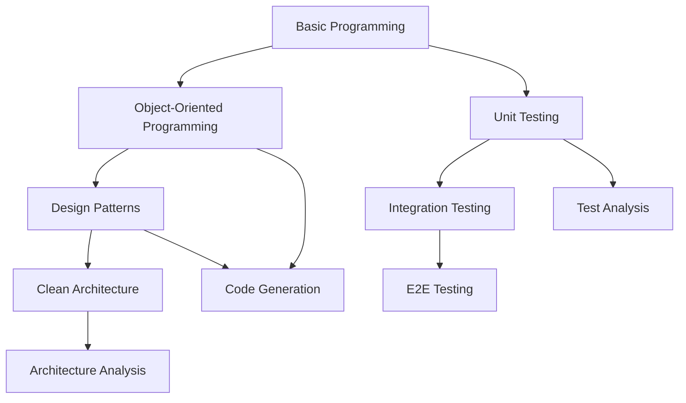

# .ai-assistant/skills

このディレクトリには、AI Assistant が保有する技術的能力（Skills）が定義されています。

## Skills とは

**Skills** は「**何ができるか**」を定義する技術的能力の宣言です。

- 使用可能なフレームワーク・ライブラリ
- 適用可能なデザインパターン
- 対応可能な技術領域
- 前提知識・経験

## Skills の構造

### 基本形式

```markdown
# {Skill Name}

## 概要
この技術に関する簡潔な説明

## 保有能力
- 能力1: 具体的な説明
- 能力2: 具体的な説明

## 前提知識
- 必要な前提知識・経験
- 依存する他の Skills

## 適用可能範囲
- 対応できること
- 対応できないこと

## 関連技術
- 関連するフレームワーク
- 関連するツール
```

### スキルレベル定義

| レベル | 説明 | 例 |
|--------|------|-----|
| **Basic** | 基本的な使用方法を理解 | 単純なクラス作成、基本的なテスト |
| **Intermediate** | 応用的な使用方法を理解 | デザインパターン適用、複雑なテスト |
| **Advanced** | 深い知識と豊富な経験 | アーキテクチャ設計、パフォーマンス最適化 |
| **Expert** | 専門家レベルの知識 | フレームワーク拡張、カスタムツール開発 |

## カテゴリ別 Skills 一覧

### 🧪 Testing Skills

Unity プロジェクトでのテスト関連技術

| Skill | Level | ファイル |
|-------|-------|----------|
| Unit Testing | Advanced | [`unit-testing-skills.md`](testing/unit-testing-skills.md) |
| Integration Testing | Intermediate | [`integration-testing-skills.md`](testing/integration-testing-skills.md) |
| E2E Testing | Intermediate | [`e2e-testing-skills.md`](testing/e2e-testing-skills.md) |
| Performance Testing | Basic | [`performance-testing-skills.md`](testing/performance-testing-skills.md) |

**主要技術**: NUnit, NSubstitute, Unity Test Framework, UniTask Testing

### 🏗️ Code Generation Skills

コード自動生成関連技術

| Skill | Level | ファイル |
|-------|-------|----------|
| Class Generation | Advanced | [`class-generation-skills.md`](code-generation/class-generation-skills.md) |
| Interface Generation | Advanced | [`interface-generation-skills.md`](code-generation/interface-generation-skills.md) |
| Boilerplate Generation | Intermediate | [`boilerplate-skills.md`](code-generation/boilerplate-skills.md) |

**主要技術**: Template Engine, Code Analysis, Roslyn, Reflection

### 🔄 Refactoring Skills

コードリファクタリング関連技術

| Skill | Level | ファイル |
|-------|-------|----------|
| Clean Code | Advanced | [`clean-code-skills.md`](refactoring/clean-code-skills.md) |
| Design Patterns | Advanced | [`design-patterns-skills.md`](refactoring/design-patterns-skills.md) |
| Architecture Patterns | Intermediate | [`architecture-skills.md`](refactoring/architecture-skills.md) |

**主要技術**: SOLID Principles, GoF Patterns, Clean Architecture, DDD

### 📊 Analysis Skills

コード分析関連技術

| Skill | Level | ファイル |
|-------|-------|----------|
| Code Analysis | Advanced | [`code-analysis-skills.md`](analysis/code-analysis-skills.md) |
| Dependency Analysis | Intermediate | [`dependency-analysis-skills.md`](analysis/dependency-analysis-skills.md) |
| Performance Analysis | Basic | [`performance-analysis-skills.md`](analysis/performance-analysis-skills.md) |

**主要技術**: Static Analysis, AST Parsing, Metrics Collection, Profiling

### 📚 Documentation Skills

ドキュメント生成関連技術

| Skill | Level | ファイル |
|-------|-------|----------|
| API Documentation | Advanced | [`api-docs-skills.md`](documentation/api-docs-skills.md) |
| README Generation | Intermediate | [`readme-skills.md`](documentation/readme-skills.md) |
| Technical Writing | Intermediate | [`technical-writing-skills.md`](documentation/technical-writing-skills.md) |

**主要技術**: Markdown, XML Documentation, Swagger/OpenAPI, Mermaid

### 🎮 Unity Specific Skills

Unity 固有の技術

| Skill | Level | ファイル |
|-------|-------|----------|
| Unity Testing | Advanced | [`unity-testing-skills.md`](unity-specific/unity-testing-skills.md) |
| ScriptableObject | Intermediate | [`scriptableobject-skills.md`](unity-specific/scriptableobject-skills.md) |
| Editor Scripting | Basic | [`editor-scripting-skills.md`](unity-specific/editor-scripting-skills.md) |

**主要技術**: MonoBehaviour Testing, Unity Test Runner, Editor Extensions

## Skills の依存関係



## Skills の使用方法

### 1. 必要な Skills の確認

作業を開始する前に、必要な Skills が利用可能かを確認：

**要求**: Unity プロジェクトで Entity クラスのテストを自動生成したい

**必要な Skills**:
- Unit Testing Skills ✅ (Advanced)
- Unity Testing Skills ✅ (Advanced) 
- Class Generation Skills ✅ (Advanced)

**結論**: 対応可能

### 2. Skills の組み合わせ

複数の Skills を組み合わせて複雑なタスクを実行：

**タスク**: Clean Architecture に準拠した UseCase とそのテストを生成

**使用 Skills**:
1. Architecture Skills (Clean Architecture の理解)
2. Class Generation Skills (UseCase クラス生成)
3. Unit Testing Skills (テスト生成)
4. Code Analysis Skills (依存関係確認)

### 3. Skills の制約確認

各 Skill には対応範囲の制約があります：

**Unit Testing Skills の制約**:
- ✅ NUnit ベースのテスト生成
- ✅ NSubstitute を使ったモック生成
- ✅ UniTask 非同期テスト
- ❌ MSTest フレームワーク
- ❌ Unity PlayMode での UI テスト

## 新しい Skills の追加方法

### 1. Skills ファイルの作成

```bash
# 新しいカテゴリの場合
mkdir -p skills/new-category

# Skills ファイル作成
touch skills/new-category/new-skill-skills.md
```

### 2. Skills の定義

新しい Skills ファイルでは以下の構造に従ってください：

```markdown
# New Skill Name

## 概要
この技術に関する概要

## 保有能力
### Basic Level
- 基本的な能力の説明

### Advanced Level  
- 高度な能力の説明

## 前提知識
- 必要な前提知識
- 依存する Skills

## 適用範囲
### 対応可能
- ○○○
- ○○○

### 対応不可
- ×××
- ×××

## 関連技術
- 技術A
- 技術B

## 更新履歴
### v1.0.0
- 初版作成
```

### 3. レジストリへの登録

`metadata/skills-registry.json` に新しい Skills を登録：

```json
{
  "id": "new-skill-skills",
  "name": "New Skill Name", 
  "category": "new-category",
  "file": "skills/new-category/new-skill-skills.md",
  "version": "1.0.0",
  "level": "Intermediate",
  "dependencies": ["prerequisite-skill"],
  "tags": ["tag1", "tag2"]
}
```

### 4. このREADMEの更新

新しいカテゴリや Skills を追加した際は、このREADMEも更新してください。

## 貢献ガイドライン

### Skills 品質基準

1. **明確性**: Skills の能力範囲が明確に定義されている
2. **具体性**: 抽象的でなく、具体的な技術・手法が示されている  
3. **完全性**: 前提知識、制約、関連技術が適切に記載されている
4. **最新性**: 使用技術のバージョンや最新情報が反映されている

### レビュープロセス

1. Skills ファイルの作成・修正
2. 関連する Instructions との整合性確認
3. 実際のプロジェクトでの動作検証
4. ドキュメントの更新
5. メタデータの更新
